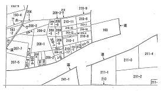
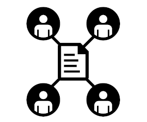

# GitとGithubを活用

ｐｐｐ
い
＋
個人情報の取り扱いには注意します。

## 私が始めたのファイル・バージョン管理サービスのご紹介 情報の管理・共有・公開を大切にすることを理念にしてます。

---

# 現場：埼玉県〇〇市△△111-22 事件：境界確認測量の件 完了予定日：〇月〇日

## 業務委任契約条項・見積計算・報告共有事項
- [業務委任契約](other-data/contract/01.md)
- [見積計算](other-data/contract/02.md)
- [報告共有事項](other-data/contract/02.md)

---
<!-- @土地家屋調査士 小川曜　URL:little-river.jp -->

## 地番参考図

---
<!-- @土地家屋調査士 小川曜　URL:little-river.jp -->

## 土地所有者一覧

|地番|登記名義人|備考|
|-|-|-|
|[11-222](acquired-data/matters)|埼玉太郎|未確定|
|[11-222](acquired-data/matters)|埼玉太郎|未確定|
|[11-222](acquired-data/matters)|埼玉太郎|未確定|
|[11-222](acquired-data/matters)|埼玉太郎|未確定|
|[11-222](acquired-data/matters)|埼玉太郎|未確定|
|[無番地道](acquired-data/matters)|〇〇市|未確定|

---
<!-- @土地家屋調査士 小川曜　URL:little-river.jp -->

## 現場へのGoogleマップ
  
クリックすると現場までのGoogleマップが表示されます。  
＊本サイトでは、さいたま地方法務局までのマップが表示されます。

---
<!-- @土地家屋調査士 小川曜　URL:little-river.jp -->

## 登記所・役所保管資料
- [登記記録情報・謄本](acquired-data/matters)
- [地図・地図・地積測量等](acquired-data/drawing)
- [道路台帳・市区町村保管資料等](acquired-data/public)

---
<!-- @土地家屋調査士 小川曜　URL:little-river.jp -->

## 進捗状況
|事案|未着手|進行中|完了|更新日付|
|-|-|-|-|-|
|[1.資料調査](progress-data/process-1.md)| 〇 | 〇 | 〇 |1/3更新|
|[2.現地・境界等の調査](progress-data/process-2.md)| 〇 | 〇 | 〇 |1/7更新|
|[3.隣地挨拶](progress-data/process-3.md)| 〇 | 〇 | 〇 |1/7更新|
|[4.筆界確認のための基礎測量](progress-data/process-4.md)| 〇 | 〇 | 〇 |1/3更新|
|[5.資料との照合・地積の算出・仮図面作成](progress-data/process-5.md)| 〇 | 〇 | | |
|[6.公共用地境界確認申請・協議](progress-data/process-6.md)| 〇 | 〇 | | |
|[7.民有地境界立会](progress-data/process-7.md)| 〇 | 〇 | | |
|[8.公共用地境界立会](progress-data/process-8.md)| 〇 | 〇 | | |
|[9.境界標の設置と境界確認書類の作成](progress-data/process-9.md)| 〇 ||||
|[10.境界確認関係書類の取り交わし](progress-data/process-10.md)| 〇 |||
|[11.登記手続と成果納品](progress-data/process-11.md)| 〇 ||||
|[12.報告事項](progress-data/info.md)| 〇 ||||

---
<!-- @土地家屋調査士 小川曜　URL:little-river.jp -->

## 現場画像・動画
- [現場画像ファイル](images-data/site)
- [境界画像ファイル](images-data/border)
- [その他画像ファイル](images-data/other)

---
<!-- @土地家屋調査士 小川曜　URL:little-river.jp -->

## 作成図面
- [仮求積図面](created-data/drawing)
- [検討図面](created-data/drawing)
- [提出用図面](created-data/drawing)
- [確定図面](created-data/drawing)

---
<!-- @土地家屋調査士 小川曜　URL:little-river.jp -->

## 作成文書
- [境界確認書](created-data/matters)
- [境界付近地物等確認書](created-data/matters)

---
<!-- @土地家屋調査士 小川曜　URL:little-river.jp -->

# 以上までが情報を管理・共有をするためのサービスです。 以下からサービスの詳細です。

## 完了後はZipファイルでお渡しします。

  

---
<!-- @土地家屋調査士 小川曜　URL:little-river.jp -->

## GitとGithubを使ったファイル管理についてのQ＆A

- > ＜Ｑ：質問＞  
GitとGithubを利用するのに費用は掛かりますか？  
＜Ａ：回答＞  
無料で利用できます。Gitはオープンソースです。また、Githubは有料プランもありますが、無料プランでも十分な機能があるため、まず無料プランを推奨しています。また、私からも現時点では、料金を頂いておりません。

- > ＜Ｑ：質問＞  
パソコンに弱いのですが、GitとGithubを利用できますか？  
＜Ａ：回答＞  
情報を確認するだけなら、サイトを閲覧するだけなので、心配はありません。情報へのアクセスはリンクになっているため、クリックかタッチをしてご利用ください。また、ご自身のファイルをGitで管理されたい場合、今はコマンドを打つだけではなく、便利な専用アプリケーションソフトがあり、その利用を推奨しています。私にご相談ください。

- > ＜Ｑ：質問＞  
GitとGithubについてセキュリティは大丈夫ですか？  
＜Ａ：回答＞  
非公開のファイルとしてGithub上で管理をするため、特定のアカウント以外はアクセスできません。また、GithubはMicrosoftの傘下のサービスであり、アメリカの政府文書や日本のIT企業も多く導入しています。信頼できるプラットホームであることをご理解頂きたいです。私自身、業務完了後の事案のファイルはすぐ削除をしたりなどの基本的な対策を行います。

- > ＜Ｑ：質問＞  
業務完了後もファイルを見たいのですが出来ますか？  
＜Ａ：回答＞  
ファイルにしてお渡しすることも出来ます。また、Gitにしたファイルはどんな環境でも設定等すれば閲覧できます。また、一般のファイルとしても保管や閲覧も出来ます。

- > ＜Ｑ：質問＞  
業務完了後もファイルを見たいのですが出来ますか？  
＜Ａ：回答＞  
ファイルにしてお渡しすることも出来ます。また、Gitにしたファイルはどんな環境でも設定等すれば閲覧できます。また、一般のファイルとしても保管や閲覧も出来ます。

---
<!-- @土地家屋調査士 小川曜　URL:little-river.jp -->

### GitとGithubはITエンジニアのファイル管理ソフトとして利用されてきました。土地家屋調査士に導入し、情報の管理と共有を大切にした仕事を私ははしていきたいと考えてます。

---

# Githubで自作のサイトの公開してみよう。

Githubを利用すれば無料で、サイトページを公開できます。  
LP(ライティングページ)の作成を支援しています。

## デモサイト公開中（準備中）

  

## Githubを活用したサイトの公開についてのQ＆A

- > ＜Ｑ：質問＞  
LP(ライティングページ)とは？  
＜Ａ：回答＞  
ランディングページ（Landing Page）とは、訪問者のアクションを誘導することに特化した縦長のレイアウトのページのことを指します。
ご自身の自己紹介ページを作成されることをおススメします。特に、Twitterの内容もリンクさせ反映させることも出来るため、
インターネットで自分を売り込んでみたいとお考えの方にはおススメです。

- > ＜Ｑ：質問＞  
好きなURL（独自ドメイン）を取得してサイトを作成できますか？  
＜Ａ：回答＞  
Githubでは、独自ドメインを取得できます。.comなら年間1000円から2000円、.jpなら年間2000円から4000年で取得、維持できます。
独自ドメインに評価された検索評価は財産になるため、出来れば独自ドメインを取得されることをおススメします。もしかしたら、昔の依頼者様が見てくれているかもしれません。

- > ＜Ｑ：質問＞  
Webに興味があるのですが、自分で作成する自身がありません。  
＜Ａ：回答＞  
最初の簡単なサイト制作はお手伝いします。またテンプレートも用意しておりますので、とりあえずサイトを持ってみたい方もおススメします。
お手伝いさせて頂くの一人一人のご要望をお聞きし、それに応じたご対応を指せていただきます。

---
<!-- @土地家屋調査士 小川曜　URL:little-river.jp -->

# 以下のサイトよりご相談ください。

 

---
<!-- @土地家屋調査士 小川曜　URL:little-river.jp -->
 # 私の思い
 私は、情報の管理・共有・公開をGithubを利用して行うことで、より分かりやすく見える業務を目指してます。 個人情報やプライバシーに関しては厳守します。

 

